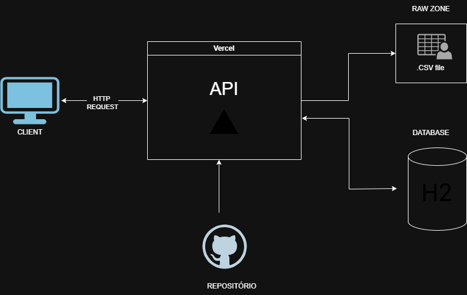

# API de Scrapping de Livros e ML

Este projeto implementa uma API Flask para servir dados de livros extraídos por web scraping do site books.toscrape.com. O projeto possui um link de deploy hospedado na Vercel, assim como possibilita a execução do código de forma local e deployado no vercel. 

# LINK DO VÍDEO

`https://youtu.be/-VeZLHOeVnM`

## DIAGRAMA ARQUITETURAL



## Estrutura de pastas

    ```
    API_SCRAPPING_LIVROS_BOOKS_JHOE/
    ├── .env                # Arquivo de variáveis de ambiente (local)
    ├── .venv/              # Ambiente virtual Python
    ├── app.py              # Ponto de entrada da aplicação Flask (a API)
    ├── instance/
    │   └── books.db        # Banco de dados (Ex: SQLite, gerado pela app)
    ├── README.md           # Este arquivo
    ├── requirements.txt    # Dependências do projeto
    ├── scripts/            # Scripts de-para (ETL, scraping, etc.)
    │   ├── configs/
    │   ├── docstream/
    │   └── scrapper/       # Módulo do web scraper
    ├── STORAGE_DATA/
    │   └── RAW_ZONE/       # Destino dos dados brutos do scraping
    │       ├── 2025-10-25.../
    │       └── ...
    └── vercel.json         # Configuração de deploy para a Vercel
    ```

## ENDPOINTS IMPLEMENTADOS

### 🔐 Autenticação (`/api/v1/auth`)

Gerencia o acesso e autenticação de usuários via JWT.

| Método | Endpoint | Descrição | Função Interna | Premissa de uso
|:--------|:----------|:-----------|:----------------| :----------------|
| **POST** | `/api/v1/auth/register` | Registra um novo usuário no sistema. | `post_api_v1_auth_register` | -Necessidade de encaminhar o raw body json: {"username": "Jhoe","password": "1234"}
| **POST** | `/api/v1/auth/login` | Autentica o usuário e retorna o token JWT. | `post_api_v1_auth_login` | -Necessidade de encaminhar o raw body json: {"username": "Jhoe","password": "1234"}
| **POST** | `/api/v1/auth/refresh` | Atualiza o token JWT expirado. | `post_api_v1_auth_refresh` | -Necessidade de utilizar o segundo token gerado no login

Todos os endpoints com exceção do /apidocs, necessitam do token JWT.
---

### 📖 Livros (`/api/v1/books`)

Permite consultar os livros armazenados no banco e realizar buscas.

| Método | Endpoint | Descrição | Função Interna |
|:--------|:----------|:-----------|:----------------|
| **GET** | `/api/v1/books` | Retorna a lista completa de livros cadastrados. | `get_api_v1_books` |
| **GET** | `/api/v1/books/search` | Pesquisa livros por título, autor ou categoria. | `get_api_v1_books_search` |
| **GET** | `/api/v1/books/{upc}` | Retorna os detalhes de um livro específico via `UPC`. | `get_api_v1_books__upc_` |
| **GET** | `/api/v1/categories/` | Lista todas as categorias disponíveis. | `get_api_v1_categories_` |

---

### 🧠 Scraping (`/api/v1/scraping`)

Responsável por iniciar o processo de raspagem dos dados diretamente do site de origem.

| Método | Endpoint | Descrição | Função Interna |
|:--------|:----------|:-----------|:----------------|
| **POST** | `/api/v1/scraping/trigger` | Executa o scraper e armazena os dados em `STAGE RAW CSV` e no banco H2. | `run_scrapper` |

---

###  Health Check (`/api/v1/health`)

Endpoint para monitoramento e verificação de disponibilidade da API.

| Método | Endpoint | Descrição | Função Interna |
|:--------|:----------|:-----------|:----------------|
| **GET** | `/api/v1/health` | Verifica se o serviço está ativo e respondendo. | `get_api_v1_health` |

---

### 📘 Documentação Swagger

A documentação interativa gerada pelo **Flasgger** pode ser acessada em:

 **`/apidocs`**  


## CONFIGURAÇÃO ACESSAR ENDPOINT (Vercel)

1. **DOMÍNIO**
   ```bash
   https://apiscrapingjhoe.vercel.app/
   ```
   
2. **DOCUMENTAÇÃO ENDPOINTS**
   ```bash
   https://apiscrapingjhoe.vercel.app/apidocs/
   ```
    
## CONFIGURAÇÃO EXECUÇÃO LOCAL (on-premises)

1.  **Crie um ambiente virtual:**
    ```bash
    python -m venv venv
    source venv/bin/activate  # (ou .\\venv\\Scripts\\activate no Windows)
    venv\Scripts\activate    #CMD
    ```

2.  **Instale as dependências:**
    ```bash
    pip install -r requirements.txt
    ```

3.  **Execute a subida da API:**
    ```bash
    python app.py
    ```

5.  **Inicie a API (Modo de Debug):**
    ```bash
    flask run
    ```
    A API estará disponível em `localhost:5000`.
    A documentação do Swagger estará em `localhost/apidocs`.


6.  **O scrapping é realizado através do endpoint**
    ```bash
    POST em `/api/v1/scraping/trigger`.
    ```

# Google Cloud 
## Beginner: Introduction to Generative AI Learning Path


`https://www.skills.google/public_profiles/d17645c1-b0fd-42c6-a806-9513736f7aa5`

